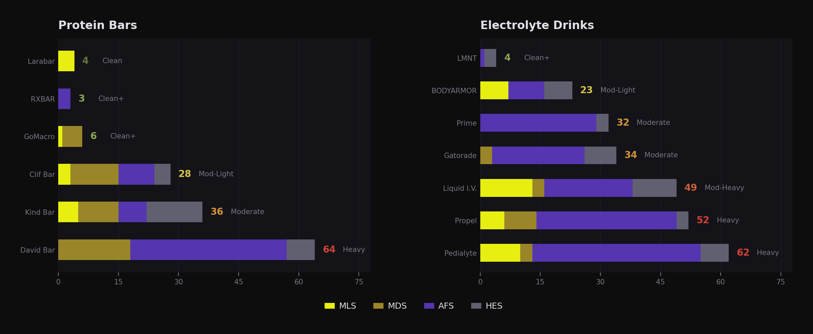
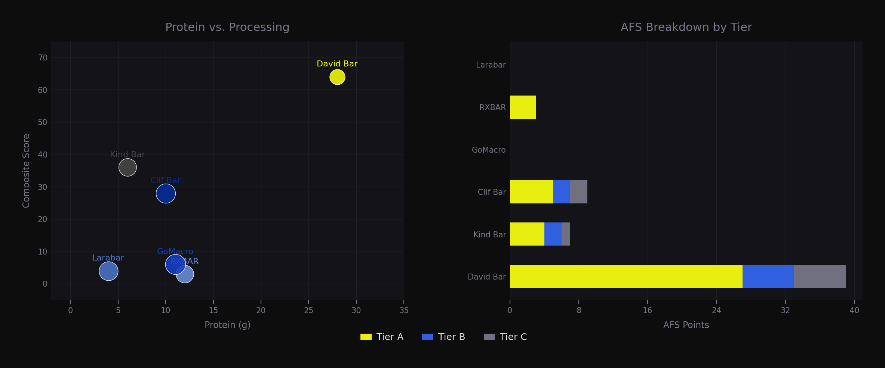
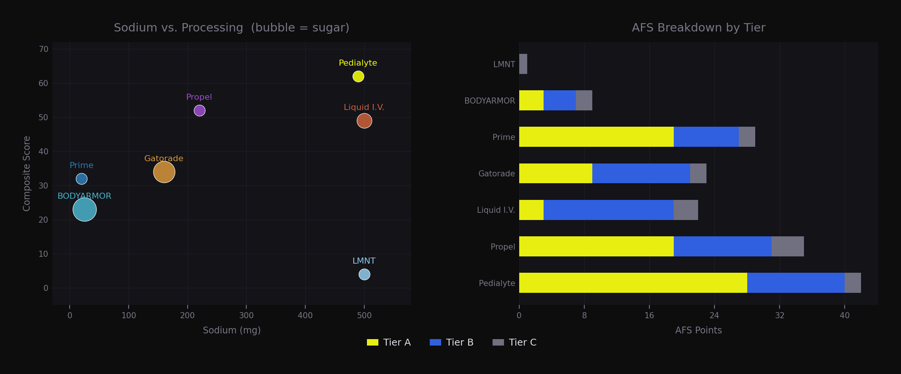
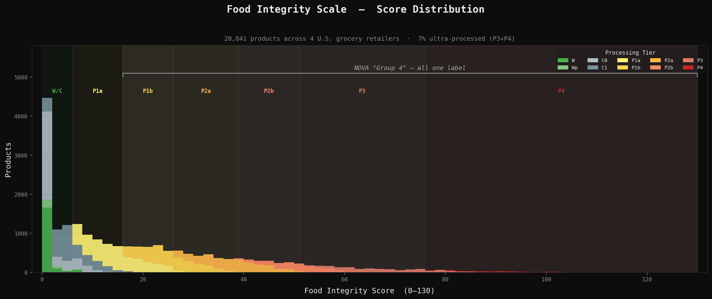

# Food Processing Ontology

Ontology and deterministic classification system for food processing, with multi-axis scoring across real-world consumer products.

The core scoring framework, the **Food Integrity Scale (FIS)**, uses deterministic multi-axis rules to classify products from ingredient lists and nutrition panels, evaluating additive formulation, hyperpalatability engineering, and metabolic load.

Fully deterministic by construction: identical inputs always produce identical outputs. Designed to operate on noisy, real-world ingredient data with inconsistent labeling formats across retailers.

Built from first principles on 28,000+ products across four U.S. grocery retailers.

## The Problem

Consumers and policymakers do not have a reliable system for evaluating how processed a food product is. Ingredients lists and nutritional profiles can be inconsistent, difficult to interpret, or simply misleading.

Evaluating food processing is a multi-dimensional problem. Existing classification systems (NOVA, EPIC, Siga) share structural failures — binary classification destroys information and single-axis systems conflate mechanisms — and fail to capture a critical distinction for modern food products: processing vs. engineering.

The food system in the U.S. is rapidly evolving — GLP-1s are reshaping consumption, functional and nutrient-dense foods are increasingly popular, and e-commerce is changing how people shop, including a stronger emphasis on whole foods and local sourcing. Policy and regulation move slowly. Behavior changes in real time.

This system does not attempt to define what is healthy. It evaluates food processing and engineering directly — what ingredients are in a product, what those ingredients are and do, and how a product is constructed and engineered. A multi-dimensional system makes it possible to distinguish between products that are superficially similar but materially different.

<p align="center">
  
</p>

<p align="center">
  
</p>

<p align="center">
  
</p>

### The Four Axes

| Axis | Range | What It Measures |
|------|-------|-----------------|
| **MDS** (Matrix Disruption) | 0-30 | How far ingredients have been removed from their whole-food origin — fractionated substrates, industrial intermediates, hydrogenated fats |
| **AFS** (Additive/Formulation) | 0-80 | Additive load by both severity (weighted by evidence tier) and density (count of unique additives) |
| **HES** (Hyperpalatability Engineering) | 0-20 | Patterns of ingredient combination that signal engineered hyperpalatability — sweetener stacking, fat-sweetener-flavor formulations |
| **MLS** (Metabolic Load) | 0-20 | Physiological burden from nutrition panel data — added sugars, sodium, saturated fat |

Each axis captures a different dimension of processing that is not redundant with the others. MDS-AFS correlation is 0.56 after double-counting removal.

### Processing Tiers

| Tier | Score | Description |
|------|-------|-------------|
| W | 0 | Whole food (single ingredient, whole-food taxonomy) |
| Wp | 0 | Whole, prepared (ground, dried, frozen — nothing added) |
| C0 | 0 | Clean, zero concerns (multi-ingredient, no markers) |
| C1 | 1-5 | Clean, minimal markers |
| P1a | 6-15 | Light processing |
| P1b | 16-25 | Moderate-light processing |
| P2a | 26-38 | Moderate processing |
| P2b | 39-50 | Moderate-heavy processing |
| P3 | 51-75 | Heavy industrial formulation |
| P4 | 76+ | Ultra-formulated |

### Metabolic Tiers

| Tier | MLS | Description |
|------|-----|-------------|
| N0 | 0 | No metabolic load |
| N0+ | 1-3 | Minimal |
| N1a | 4-6 | Low |
| N1b | 7-8 | Low-moderate |
| N2 | 9-14 | Moderate |
| N3 | 15+ | High |

## System Architecture

```
Product data (name, ingredients, nutrition, serving size)
    |
    v
Ingredient normalization
    Allergen stripping, enrichment context removal,
    store-aware parsing, nesting depth analysis
    |
    v
Taxonomy classification (11 families, 64 subfamilies)
    LLM classifier (Claude Haiku) + deterministic fallback
    SHA-256 cached to disk, version-gated
    |
    v
Ontology pattern matching (174 regex patterns)
    Tier A/B/C additives, Bucket 2/3 substrates,
    HES sweetener/fat/flavor lists
    |
    v
Four-axis scoring engine
    MDS + AFS + HES + MLS = Composite (0-150)
    |
    v
Classification (10 processing tiers, 6 metabolic tiers)
```

<p align="center">
  
</p>

## The Ontology

The ingredient classification ontology contains **174 regex patterns** organized into functional groups:

- **Additive tiers (AFS):** 46 Tier A (artificial dyes, strong emulsifiers, NNS), 54 Tier B (gums, preservatives, phosphates), 25 Tier C (conditional — citric acid, pectin, ascorbic acid). Tier C scores only when industrial context exists.
- **Matrix disruption buckets (MDS):** 28 Bucket 2 (refined oils, starches, fiber isolates, dairy powders), 15 Bucket 3 (maltodextrin, HFCS, protein isolate, hydrogenated fats).
- **Hyperpalatability patterns (HES):** 25 caloric sweeteners, 9 NNS, 5 flavor ingredients, 6 flavor enhancers, 5 coating fats. Six detection patterns evaluate ingredient *combinations*, not individual ingredients.

Every pattern includes nesting depth analysis — maltodextrin inside "mushroom powder (maltodextrin, mushroom extract)" receives reduced weight relative to a top-level ingredient.

## Example: Two Yogurts

**Fage Total 0% Blueberry** — Composite: **16** (P1b)
```
Ingredients: Grade A pasteurized skimmed milk, live active yogurt
cultures, blueberries, sugar, water, pectin, locust bean gum,
natural flavors, lemon juice concentrate
MDS: 3  |  AFS: 9  |  HES: 4  |  MLS: 0
```

**Dannon Light + Fit Greek Fat Free Banana Cream** — Composite: **51** (P3)
```
Ingredients: Cultured pasteurized non fat milk, water, fructose,
banana puree, natural and artificial flavors, fruit & vegetable juice
concentrate and beta carotene (for color), modified food starch,
pectin, xanthan gum, acesulfame potassium, sucralose, malic acid,
potassium sorbate
MDS: 8  |  AFS: 36  |  HES: 7  |  MLS: 0
```

NOVA classifies both as Group 4. FIS sees a 35-point gap: the Fage Blueberry has a fruit preparation with natural flavor, one gum, and pectin. The "Light" yogurt needs sucralose, acesulfame K, artificial flavors, modified starch, and a preservative to taste like yogurt again. Its MLS is 0 — nothing left to flag metabolically — but it carries more additives than many candy bars.

## Dataset

**28,000+ products** from U.S. grocery retailers spanning mass-market, full-service, specialty, and curated clean-food channels. **26,000+** with complete processing classifications after excluding non-food items and products with missing ingredient data.

Designed for robustness to inconsistent ingredient lists and labeling formats across retailers.

## Interactive Demos

- **[Protein Bars](https://dmh221.github.io/food-processing-ontology/demos/protein_bars.html)** — 6 bars from C0 to P3. More protein doesn't mean more processing.
- **[Yogurt](https://dmh221.github.io/food-processing-ontology/demos/yogurt.html)** — The diet yogurt paradox: the "Light" yogurt is the most processed.
- **[Peanut Butter](https://dmh221.github.io/food-processing-ontology/demos/peanut_butter.html)** — The nut butter ladder: from raw peanuts to sugar-first spreads.
- **[Electrolytes](https://dmh221.github.io/food-processing-ontology/demos/electrolytes.html)** — The hydration spectrum: salt water to synthetic cocktail.

## Key Design Decisions

**Decomposition over classification**
Processing is not a single dimension. The system decomposes it into independent axes (MDS, AFS, HES, MLS) so different mechanisms can be evaluated separately.

**Ontology-first, not model-first**
The system is built on a hand-defined ingredient ontology (regex patterns with tiered weights), not a trained model. Every score is deterministic, auditable, and reproducible.

**Context-sensitive scoring**
Ingredients are not scored in isolation. The same ingredient can signal different things depending on context—nesting depth, co-occurrence with other ingredients, and product type all affect how it is evaluated.

**Built on real-world data, not theory**
The scoring rules were developed against 28,000+ grocery products and iterated based on observed behavior—adjusting caps, weights, and rules when the system failed to separate products as expected.

## Project Structure

```
scoring/
    ontology.py          Ingredient ontology — 174 patterns, tiers, buckets
    scorer.py            Orchestrator — normalization, scanning, 4-axis scoring
    normalize.py         Store-aware ingredient parsing, allergen stripping
    product_taxonomy.py  LLM taxonomy classifier (11 families, 64 subfamilies)
    rules_mds.py         Matrix Disruption Score
    rules_afs.py         Additive/Formulation Score
    rules_hes.py         Hyperpalatability Engineering Score
    rules_mls.py         Metabolic Load Score
    micro_label.py       Micro-label classifier (regex + LLM, 4th taxonomy level)
analysis/
    generate_comparison.py   Data-driven interactive comparison generator
    style.py                 Shared chart builders (Plotly dark-mode)
    data/                    Product comparison datasets (JSON)
tests/                   280 tests — ontology, scoring rules, anchors, ETL
docs/
    fis_methodology_and_findings.md   Full methodology paper and empirical findings
```

## Quick Start

```bash
python -m venv venv && source venv/bin/activate
pip install -r requirements.txt

# Run tests (no external data needed)
python -m pytest tests/ -v

# Score products
python run_scoring.py

# Generate interactive comparisons
python analysis/generate_comparison.py analysis/data/*.json
```

Taxonomy classification requires an Anthropic API key (`ANTHROPIC_API_KEY` env var) for Claude Haiku. Use `--no-llm` to skip LLM classification.

## Validation

- **NOVA concordance:** W/Wp maps to NOVA Group 1, C0/C1 to Groups 2/3, P1b+ to Group 4. FIS adds 7-tier discrimination within Group 4.
- **Sensitivity analysis:** 22 parameter variations tested. All preserve tier monotonicity. Most impactful: HES 2.0x scaling (25% composite change). [Full analysis](analysis/classification_sensitivity.md)
- **Axis independence:** MDS-AFS correlation 0.56 after double-counting removal. Each axis captures a non-redundant dimension.
- **Farm to People anchor:** 80.6% of FTP products score W/C0/C1. Zero P2b/P3/P4. Confirms the scoring floor works.

## Methodology

See [docs/fis_methodology_and_findings.md](docs/fis_methodology_and_findings.md) for the full methodology paper, including validation against NOVA, sensitivity analysis, and empirical findings from 27,941 products across four U.S. grocery retailers.

## License

[MIT](LICENSE)
