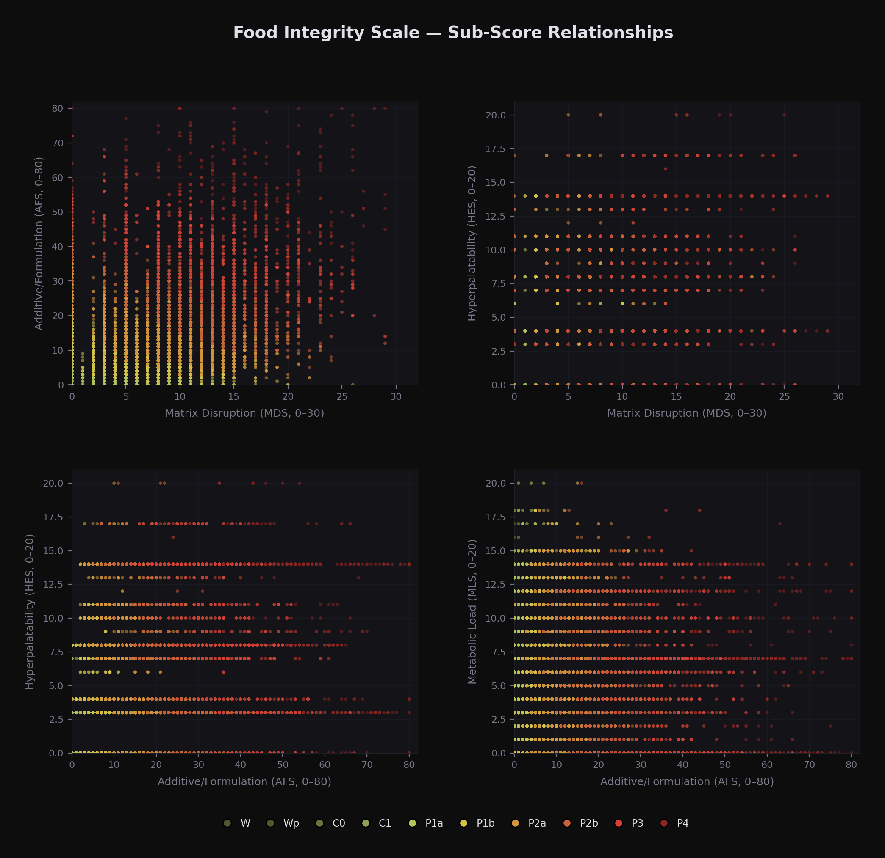

# Food Integrity Scale (FIS)

A multi-axis, continuous scoring system for food processing classification. FIS takes a product's ingredient list and nutrition panel and produces a composite score from 0 to 150, classifying products into 10 processing tiers and 6 metabolic tiers.

Built in response to the FDA/USDA's 2025 Request for Information on defining ultra-processed foods. Where NOVA puts Fanta and a yogurt with xanthan gum in the same group, FIS produces a 3x score difference and explains *why* through four independent sub-scores.

<p align="center">
  
</p>

<p align="center">
  
</p>

<p align="center">
  
</p>

## Why FIS Exists

Existing classification systems (NOVA, EPIC, Siga) share three structural failures:

1. **Binary classification destroys information** — NOVA Group 4 spans products scoring 6 to 150+ on FIS
2. **Low inter-rater reliability** — Expert agreement on NOVA is ~0.33 Fleiss' kappa
3. **Single-axis systems can't distinguish mechanisms** — Nutrient profile, additive load, matrix disruption, and hyperpalatability engineering are separate exposures that need separate measurement

FIS is fully deterministic: same inputs always produce the same score. Inter-rater reliability is 1.0 by construction.

## Architecture

Four independent sub-scores sum to a composite (0–150):

| Sub-score | What it measures | Range |
|-----------|-----------------|-------|
| **MLS** | How extreme the nutrition label is — flagging high sugar, sodium, saturated fat, and energy-dense sweet formulations. | 0–20 |
| **MDS** | How many core ingredients have been replaced by industrial substitutes (modified starches, hydrogenated fats, HFCS, protein isolates). | 0–30 |
| **AFS** | How many chemical additives are stacked in — emulsifiers, preservatives, artificial colors, flavor enhancers. | 0–80 |
| **HES** | How engineered the sweetener system is — sugar alcohols, non-nutritive sweeteners, and multi-sweetener blending strategies. | 0–20 |
| **Composite** | MDS + AFS + HES + MLS. How far a product has moved from recognizable food. | **0–150** |

### Classification Tiers

**Processing class** — derived from composite score:

| Tier | Name | Score |
|------|------|-------|
| C0 | Clean | 0 |
| C1 | Clean, Minimal Markers | 1–5 |
| P1a | Light Processing | 6–15 |
| P1b | Moderate-Light Processing | 16–25 |
| P2a | Moderate Processing | 26–38 |
| P2b | Moderate-Heavy Processing | 39–50 |
| P3 | Heavy Industrial Formulation | 51–75 |
| P4 | Ultra-Formulated | 76+ |

**Metabolic class** — derived from MLS:

| Tier | Name | Score |
|------|------|-------|
| N0 | No Metabolic Load | 0 |
| N0+ | Minimal | 1–3 |
| N1a | Low | 4–6 |
| N1b | Low-Moderate | 7–8 |
| N2 | Moderate | 9–14 |
| N3 | High | 15+ |

<p align="center">
  
</p>

## Interactive Demos

Pre-built interactive HTML comparisons (open in any browser):

- **[Protein Bars](demos/protein_bars.html)** — 6 bars from C0 (Larabar, score 4) to P3 (David, score 64). More protein doesn't mean more processing.
- **[Yogurt](demos/yogurt.html)** — The diet yogurt paradox: Light+Fit (score 51) is the most processed yogurt despite having the least sugar.
- **[Peanut Butter](demos/peanut_butter.html)** — The nut butter ladder: from Smucker's Natural (score 0) to Nutella (score 34).
- **[Electrolytes](demos/electrolytes.html)** — The hydration spectrum: LMNT (score 4) to Pedialyte Sport (score 62). Same promise, 15x score spread.

To regenerate:
```bash
python analysis/bar_comparison_interactive.py
python analysis/yogurt_comparison_interactive.py
python analysis/peanut_butter_comparison_interactive.py
python analysis/electrolyte_comparison_interactive.py
```

## Setup

```bash
python -m venv venv
source venv/bin/activate
pip install -r requirements.txt
```

## Run Tests

The test suite (256 tests) validates the scoring engine with hardcoded fixtures — no external data needed:

```bash
python -m pytest tests/ -v
```

## Scoring Your Own Data

1. Place scraped product JSON in `data/scraped/` (format: list of objects with `name`, `ingredients`, `nutrition` fields)
2. Uncomment/add entries in `STORE_FILES` in `run_scoring.py`
3. Run: `python run_scoring.py`

Taxonomy classification requires an Anthropic API key (`ANTHROPIC_API_KEY` env var) for Claude Haiku. Use `--no-llm` to skip LLM classification (products get fallback labels).

## Project Structure

```
scoring/
  ontology.py          # Additive/ingredient ontology (Tier A/B/C, Bucket 2/3, sweeteners)
  scorer.py            # Main scoring pipeline — FIS composite from sub-scores
  rules_mds.py         # Matrix Disruption Score
  rules_afs.py         # Additive/Formulation Score
  rules_hes.py         # Hyperpalatability Engineering Score
  rules_mls.py         # Metabolic Load Score
  product_taxonomy.py  # LLM-based product family classification (Claude Haiku)
  micro_label.py       # Fine-grained product sub-labels (regex + LLM)
  normalize.py         # Ingredient text normalization
  anchors.csv          # Known-product validation anchors
tests/                 # 280 unit + integration tests
analysis/
  style.py             # Shared design system — palette, layout, chart builders
  *_interactive.py     # Category comparison generators (Plotly)
docs/                  # Methodology paper + figures
demos/                 # Pre-built interactive HTML visualizations
```

## Methodology

See [docs/methodology.md](docs/methodology.md) for the full methodology paper, including validation against NOVA, sensitivity analysis, and findings from scoring 27,680 products across four U.S. grocery retailers.

## License

MIT
